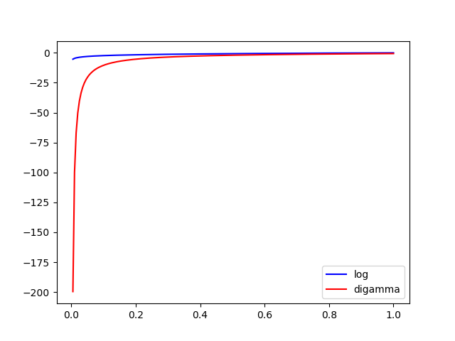

# WeRlearning

### entropy.py
the more uniform a distribution, the larger its entropy 

### digamma.py
digamma(x) is the derivative of log(gamma(x))
digamma function approach log when x larger than 1

